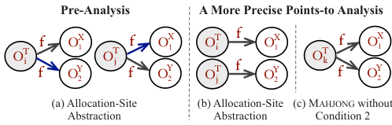
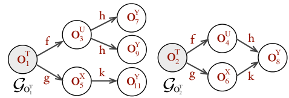
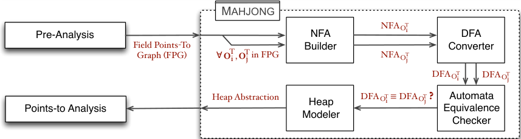
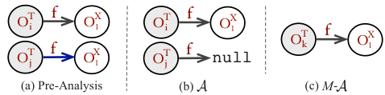
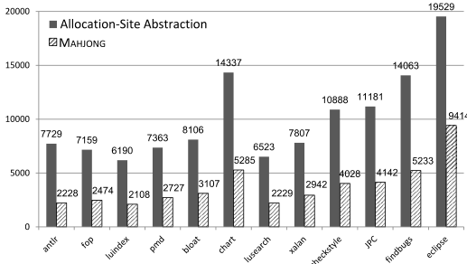
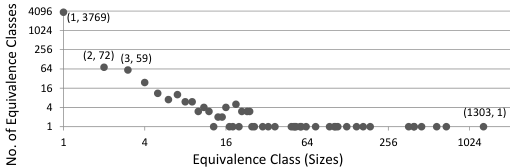

# **Efficient and Precise Points-to Analysis:**

**Modeling the Heap by Merging Equivalent Automata**

Tian Tan$^*$ \quad Yue Li$^*$ \quad Jingling Xue

School of Computer Science and Engineering, UNSW, Australia

## **Abstract**

Mainstream points-to analysis techniques for object-oriented languages rely predominantly on the allocation-site abstraction to model heap objects. We present MAHJONG, a novel heap abstraction that is specifically developed to address the needs of an important class of type-dependent clients, such as call graph construction, devirtualization and may-fail casting. By merging equivalent automata representing type-consistent objects that are created by the allocation-site abstraction, MAHJONG enables an allocation-site-based points-to analysis to run significantly faster while achieving nearly the same precision for type-dependent clients.

MAHJONG is simple conceptually, efficient, and drops easily on any allocation-site-based points-to analysis. We demonstrate its effectiveness by discussing some insights on why it is a better alternative of the allocation-site abstraction for type-dependent clients and evaluating it extensively on 12 large real-world Java programs with five context-sensitive points-to analyses and three widely used type-dependent clients. MAHJONG is expected to provide significant benefits for many program analyses where call graphs are required.

**CCS Concepts** $\bullet$ Theory of computation $\rightarrow$ Program analysis

**Keywords** points-to analysis, heap abstraction

## **1. Introduction**

_Pointer Analyses should be designed to be appropriate in cost and precision for specific groups of client problems. We do not need a different pointer analysis per client problem, but rather we should look for classes of client problems with similar needs._

— Barbara Ryder [17]

Every points-to analysis, especially for object-oriented languages such as Java and C\#, requires a heap abstraction for partitioning the infinitely-sized heap into a finite number of (abstract) objects. For object-oriented programs, context-sensitivity is important for achieving useful precision. Due to many years of research, context-sensitivity can be achieved by three main approaches with different efficiency and precision tradeoffs: call-site-sensitivity [15, 22, 36, 42, 51, 53], object-sensitivity [29, 40, 48] and type-sensitivity [39].

However, little progress has been made on developing heap abstractions for points-to analysis. Mainstream points-to analysis frameworks for Java, such as CHORD [10], DOOP [14], SOOT [49] and WALA [50], rely predominantly on the allocation-site abstraction to model heap objects. In this case, distinct allocation sites are represented by distinct (abstract) objects, with one object per site, which can be further separated context-sensitively in an orthogonal manner.

As programming languages become more heap-intensive, the need for effective heap abstractions is greater [19, 38, 44]. The suitability of the allocation-site abstraction as a universal solution for all clients of points-to analysis needs to be revisited. While maximizing the precision for _may-alias_, this abstraction often over-partitions the heap without improving the precision much for an important class of type-dependent clients such as _call graph construction, devirtualization_ and _may-fail casting_, causing often the underlying points-to analysis to be unscalable for large programs. For this reason, WALA [50] and DOOP [14], provide an option for all objects of a certain class, such as `java.lang.String` or `java.lang.StringBuffer`, to be merged ad hocly.

In this paper, we present MAHJONG, a novel heap abstraction that is specifically developed to address the needs of type-dependent clients. Given a program, we first create a lightweight alternative of the allocation-site abstraction by performing a fast but imprecise allocation-site-based points-to analysis as a pre-analysis and then use it to drive a subsequent points-to analysis. Based on the points-to information found during the pre-analysis, MAHJONG merges two objects if both are type-consistent, i.e., if the objects reached from both along the same sequence of field accesses have a common type. We formulate the problem of checking the type-consistency of two objects as one of testing the equivalence of two sequential automata in almost linear time, by applying a classic Hopcroft-Karp algorithm [18] with minor

- These authors contributed equally to this work

Permission to make digital or hard copies of all or part of this work for personal or
classroom use is granted without fee provided that copies are not made or distributed
for profit or commercial advantage and that copies bear this notice and the full citation
on the first page. Copyrights for components of this work owned by others than ACM
must be honored. Abstracting with credit is permitted. To copy otherwise, or republish,
to post on servers or to redistribute to lists, requires prior specific permission and/or a
fee. Request permissions from Permissions@acm.org.

modifications. MAHJONG is simple conceptually and drops easily on any allocation-site-based points-to analysis.

Compared to the allocation-site abstraction, MAHJONG allows a points-to analysis to run significantly faster while achieving nearly the same precision for type-dependent clients. Thus, MAHJONG makes it possible to accelerate a given points-to analysis or replace it with a more precise but usually more costly points-to analysis that is either inefficient or unscalable if the allocation-site abstraction is used. MAHJONG is expected to provide significant benefits to many program analyses, such as bug detection, security analysis, program verification and program understanding, where call graphs are required [3, 5, 7, 16, 26, 31, 32, 43, 54, 55].

We demonstrate the effectiveness of MAHJONG by discussing some insights on why it is a better alternative of the allocation-site abstraction for type-dependent clients and conducting an evaluation extensively on 12 large Java programs with five widely used context-sensitive points-to analyses and three significant type-dependent clients, call graph construction, devirtualization and may-fail casting [20, 22, 39, 40, 42]. Take, $3obj$, a 3-object-sensitive points-to analysis [29], the most precise one used in our evaluation, as an example. For the four programs that can be analyzed scalably under $3obj$, our MAHJONG-based $3obj$ runs 131X faster, on average, while achieving nearly the same precision for all the three clients. For the remaining eight, where $3obj$ is unscalable in 5 hours each, our MAHJONG-based $3obj$ can analyze five of them in an average of 33.42 minutes.

In summary, our paper makes the following contributions:

- We present MAHJONG, a new heap abstraction that can significantly scale an allocation-site-based points-to analysis for object-oriented programs while achieving nearly the same precision for type-dependent clients.
- We formulate the problem of checking the type-consistency of two objects as one of testing the equivalence of two automata, which is solvable in almost linear time.
- We implement MAHJONG as a stand-alone open-source tool. MAHJONG is simple (with only 1500 LOC of Java in total) and drops easily on any allocation-site-based points-to analysis.
- We conduct extensive experiments to evaluate the effectiveness of MAHJONG in practice.

## **2. Motivation**

For points-to analysis, _type-dependent clients_, such as call graph construction, devirtualization and may-fail casting, share similar needs: their precision depends on the types of pointed-to objects rather than the pointed-to objects themselves. For such clients, the conventional allocation-site abstraction is often too fine-grained, contributing little to improving their precision but rendering the underlying points-to analysis unduly inefficient or eventually unscal-

```java
 1 A x = new A(); // o_1^A
 2 A y = new A(); // o_2^A
 3 A z = new A(); // o_3^A
 4 x.f = new B(); // o_4^B
 5 y.f = new C(); // o_5^C
 6 z.f = new C(); // o_6^C
 7 A a = z.f;
 8 a.foo();
 9 C c = (C) a;

10 class A {
11   A f;
12   void foo() {...}
13 }
14 class B extends A {
15   void foo() {...}
16 }
17 class C extends A {
18   void foo() {...}
19 }
```

**Figure 1.** An example program illustrating object merging

able. In this paper, we aim to improve this by looking for a lightweight alternative that satisfies the needs of type-dependent clients, but not necessarily others such as may-alias. To this end, we would like to avoid distinguishing two objects if merging them loses no or little precision.

In Section 2.1, we see that blindly merging objects of the same type is ineffective. In Section 2.2, we describe our solution that merges objects representing equivalent automata only. For object-oriented programs, merging objects amounts to merging their corresponding allocation sites.

### **2.1 Allocation-Type Abstraction: A Naive Solution**

In this so-called _allocation-type abstraction_, all objects with the same type are merged, with one object per type. As previously noted, this naive solution often gains efficiency but may incur a significant loss of precision [19, 27, 38, 51].

**Example 2.1.** Consider Figure 1, where $o_i^t$ represents the abstract object of type $t$ created at the allocation site at line $i$. We will use this notation in the rest of the paper.

For the three type-dependent clients, call graph construction, devirtualization and may-fail casting, only lines 8 – 9 are relevant. According to an allocation-site-based Andersen’s points-to analysis [4], $x$, $y$ and $z$ point to $o_1^A$, $o_2^A$ and $o_3^A$, respectively. As $x.f$, $y.f$ and $z.f$ are not aliases, $a$ points to $o_6^C$. Thus, $a.foo()$ at line 8 is a mono-call and can thus be devirtualized, and in addition, the cast ($C$) at line 9 is safe.

However, if $o_1^A$, $o_2^A$ and $o_3^A$ are merged, then $x.f$, $y.f$ and $z.f$ will be aliases, causing $a$ to also point to $o_4^B$. As a result, $a.foo()$ becomes a poly-call and thus non-devirtualizable. In addition, the cast ($C$) is no longer considered safe. $\square$

Consider pmd, a program analyzed by (1) _3obj_—a 3-object-sensitive points-to analysis [29] using the allocation-site abstraction, (2) _T-3obj_—_3obj_ using the allocation-type abstraction, and (3) _M-3obj_—_3obj_ using the MAHJONG heap abstraction introduced in this paper. For _3obj_, pmd is analyzed in 14469.3 seconds, allowing 44004 call graph edges to be discovered. _T-3obj_ is the fastest (50.3 seconds), but is the most imprecise (50666 call graph edges). In contrast, _M-3obj_ is as precise as _3obj_ (44016 call graph edges) but is also nearly as fast as _T-3obj_ (127.7 seconds).



**Figure 2.** Field points-to graph rooted at $o_1^T$ and $o_2^T$.

### **2.2 MAHJONG: Our Solution**

To address the needs of type-dependent clients, MAHJONG is designed to maximally preserve the precision of the allocation-site abstraction while reaping the efficiency of the allocation-type abstraction as much as possible. For a given program, we first build a heap abstraction by performing a pre-analysis, i.e., a fast but imprecise allocation-site-based Andersen's points-to analysis [4] and then use it to guide a subsequent points-to analysis. Based on the pre-analysis, we define type-consistent objects that can be merged (Section 2.2.1) and formulate the problem of checking the type-consistency of two objects as one of testing the equivalence of two automata in almost linear time (Section 2.2.2).

### **2.2.1 Defining Type-Consistent Objects**

After the pre-analysis, the field points-to graph (FPG) is available, representing the points-to information for the object fields. To facilitate a subsequent reduction of the problem of checking type-consistency as one of testing the equivalence of automata, we introduce the field points-to graph rooted at an object $o$ as $\mathcal{G}_o = (\mathcal{H}, \mathcal{F}, \alpha, o, \mathcal{T}, \tau)$. $\mathcal{H}$ is the set of objects reachable from $o$. $\mathcal{F}$ is the set of field names traversed along the way. The points-to relations for the object fields are defined by a field points-to map $\alpha : \mathcal{H} \times \mathcal{F} \mapsto \mathcal{P}(\mathcal{H})$. $\mathcal{T}$ is the set of types of the objects in $\mathcal{H}$. The object-to-type map $\tau : \mathcal{H} \mapsto \mathcal{T}$ reveals the type of an object.

Figure 2 gives the field points-to graphs rooted at $o_1^T$ and $o_2^T$, by using the same notation for objects in Figure 1.

**Example 2.2.** Consider $o_2^T$ first in Figure 2. $\mathcal{G}_{o_2^T} = (\mathcal{H}, \mathcal{F}, \alpha, o_2^T, \mathcal{T}, \tau)$. $\mathcal{H} = \{o_2^T, o_4^U, o_6^X, o_8^Y\}$; $\mathcal{F} = \{f, g, h, k\}$; $\alpha[o_2^T, f] = \{o_4^U\}$, $\alpha[o_4^U, h] = \{o_8^Y\}$, $\alpha[o_2^T, g] = \{o_6^X\}$, and $\alpha[o_6^X, k] = \{o_8^Y\}$; $\mathcal{T} = \{T, U, X, Y\}$; and $\tau[o_2^T] = T$, $\tau[o_4^U] = U$, $\tau[o_6^X] = X$, and $\tau[o_8^Y] = Y$. Similarly, $\mathcal{G}_{o_1^T}$ can be constructed. $\square$

Unlike the allocation-type abstraction, where all the objects with the same type are merged blindly, we will merge so-called type-consistent objects, thereby avoiding the imprecision introduced by the allocation-type abstraction.

Let $\bar{f} = f_1.f_2.\cdots.f_n$, where $n > 0$, be a sequence of field names. For the field points-to graph $\mathcal{G}_o$ rooted at an object $o$, we write $pts(o.\bar{f})$ to represent the set of objects that can be reached from $o$ along any path of points-to edges labeled by $f_1, f_2, ..., f_n$ in $\mathcal{G}_o$ in that order. In Figure 2, $pts(o_1^T.f) = \{o_3^U\}$ and $pts(o_1^T.f.h) = \{o_7^Y, o_9^Y\}$.

Two objects with the same type are type-consistent if traversing from the two objects along the same sequence of field names always lead to objects of one single type.

**Definition 2.1 (Type-Consistent Objects).** Two objects, $o_i$ and $o_j$, with the same type are said to be _type-consistent_, denoted $o_i \equiv o_j$, if for every sequence of field names, $\bar{f} = f_1.f_2.\cdots.f_n$, the following two conditions hold:

1. $\{\tau[o] \mid o \in pts(o_i.\bar{f})\} = \{\tau[o] \mid o \in pts(o_j.\bar{f})\}$, and
2. $\left|\{\tau[o] \mid o \in pts(o_i.\bar{f})\}\right| = 1$.

In Figure 2, $o_1^T$ and $o_2^T$ are type-consistent. For the objects reached from $o_1^T$ and $o_2^T$, along $f$, $f.h$, $g$ and $g.k$, their sets of types are $\{U\}$, $\{Y\}$, $\{X\}$ and $\{Y\}$, respectively.

We illustrate the intuition behind the notion of type-consistency with an example discussed below.

**Example 2.3.** Let us return to Figure 1, for which the allocation-type abstraction will merge $o_1^A$, $o_2^A$ and $o_3^A$ (Section 2.1). By Definition 2.1, $o_2^A$ and $o_3^A$ are type-consistent (as $o_2^A.f$ points to $o_5^C$ and $o_3^A.f$ points to $o_6^C$) but $o_1^A$ is not type-consistent with any (as $o_1^A.f$ points to $o_4^B$). After $o_2^A$ and $o_3^A$ are merged, $y.f$ and $z.f$ are regarded as aliases. Thus, $a$ will point to not only $o_5^C$ as before but also $o_5^C$ spuriously. However, as $o_5^C$ and $o_6^C$ have the same type $C$, the precision of call graph construction and devirtualization at line 8 and may-fail casting at line 9 will not be affected. $\square$

Let us examine Definition 2.1. Condition 1 is self-explanatory in order to maximally preserve precision for type-dependent clients. What is the rationale behind Condition 2? The pre-analysis is fast but imprecise. Enforcing Condition 2 maximally avoids precision loss, as shown below



**Figure 3.** Illustrating Condition 2 in Definition 2.1

**Example 2.4.** Suppose $o_i^T.f$ and $o_j^T.f$ point to both $o_1^X$ and $o_2^Y$ during the pre-analysis (Figure 3(a)) but $o_1^X$ and $o_2^Y$, respectively, in a more precise allocation-site-based points-to analysis, $\mathcal{A}$ (Figure 3(b)). If Condition 2 is ignored, $o_i^T$ and $o_j^T$ will become type-consistent according to the pre-analysis and thus merged into, say, $o_k^T$ (represented by $o_i^T$ or $o_j^T$). Running $\mathcal{A}$ with this new abstraction will result in precision loss, as $o_i^T.f$ and $o_j^T.f$ now point to objects of types $X$ and $Y$ (Figure 3(c)).

In Definition 2.1, the type-consistency relation $\equiv$ is an equivalence relation. It is straightforward to verify that $\equiv$ is reflexive, symmetric and transitive.

Let $\mathbb{H}$ be the set of all abstract objects in the program.

Equivalent $\textcolor{red}{\text{Automata}}$ $\Longleftrightarrow$ Type-Consistent $\textcolor{blue}{\text{Objects}}$

| Sequential Automata                                      | $\mathcal{A}_o = (Q, \Sigma, \delta, q_0, \Gamma, \gamma)$ | $\Longleftrightarrow$ | $\mathcal{G}_o = (\mathcal{H}, \mathcal{F}, \alpha, o, \mathcal{T}, \tau)$ | $o$-Rooted Field Points-to Graph                                                       |
| :------------------------------------------------------- | :--------------------------------------------------------: | :-------------------: | :------------------------------------------------------------------------- | :------------------------------------------------------------------------------------- |
| A set of states                                          |                            $Q$                             | $\Longleftrightarrow$ | $\mathcal{H}$                                                              | A set of heap objects                                                                  |
| A set of input symbols                                   |                          $\Sigma$                          | $\Longleftrightarrow$ | $\mathcal{F}$                                                              | A set of field identifiers                                                             |
| The next-state map: $Q \times \Sigma \to \mathcal{P}(Q)$ |                          $\delta$                          | $\Longleftrightarrow$ | $\alpha$                                                                   | The field points-to map: $\mathcal{H} \times \mathcal{F} \to \mathcal{P}(\mathcal{H})$ |
| The initial state                                        |                           $q_0$                            | $\Longleftrightarrow$ | $o$                                                                        | The object to be checked                                                               |
| A set of output symbols                                  |                          $\Gamma$                          | $\Longleftrightarrow$ | $\mathcal{T}$                                                              | A set of types                                                                         |
| The output map: $Q \to \Gamma$                           |                          $\gamma$                          | $\Longleftrightarrow$ | $\tau$                                                                     | The object-to-type map: $\mathcal{H} \to \mathcal{T}$                                  |

**Figure 4.** The mapping of a field points-to graph rooted at an object to a sequential automaton.

**Definition 2.2 (MAHJONG's Heap Abstraction).** Given the quotient set, $\mathbb{H} / \equiv$, MAHJONG will merge all the objects in the same equivalence class into one object.

Therefore, the key insight behind our new heap abstraction is not to distinguish two (container) objects of the same type if both containers store the objects of the same type at all their corresponding nested sub-containers.

How do we check the type-consistency of two objects efficiently, especially for large programs with a large number of heap objects, field names and class types? Enumerating all the possible field access paths $\bar{f}$ as required in Definition 2.1, especially in the presence of cycles, may be exponential in terms of the number of edges traversed [28, 34], causing the pre-analysis to be too inefficient or even unscalable. We describe a fast and elegant solution below.

Therefore, we have reduced the problem of checking the type-consistency of $o_1^T$ and $o_2^T$ to one of testing the equivalence of their corresponding automata $\mathcal{A}_{o_1^T}$ and $\mathcal{A}_{o_2^T}$, which is solvable by the Hopcroft-Karp algorithm [18] with minor modifications. The worst-case time complexity is $O(|\Sigma| \times |Q_{\text{larger}}|)$, which is almost linear in terms of $|Q_{\text{larger}}|$, where $Q_{\text{larger}}$ is the set of states of the larger automaton [18].

**Example 2.6.** Continuing from Example 2.5, we see easily that $o_1^T$ and $o_2^T$ are type-consistent (Figure 2) since their corresponding automata $\mathcal{A}_{o_1^T}$ and $\mathcal{A}_{o_2^T}$ are equivalent. $\square$

### **2.2.2 Merging Equivalent Automata**

We transform the problem of checking the type-consistency of two objects into one of testing the equivalence of two automata. Figure 4 relates the field points-to graph rooted at an object $o$, $\mathcal{G}_o = (\mathcal{H}, \mathcal{F}, \alpha, o, \mathcal{T}, \tau)$, to a 6-tuple sequential automaton $\mathcal{A}_o = (Q, \Sigma, \delta, q_o, \Gamma, \gamma)$ [1], which is more general than a traditional (5-tuple) automaton. In fact, a 5-tuple automaton can be turned into a 6-tuple automaton, if its accepting (acc) and non-accepting (non-acc) states are distinguished by $\gamma: Q \mapsto \Gamma$, where $\Gamma = \{\text{acc}, \text{non-acc}\}$.

**Example 2.5.** Continuing from Example 2.2 (Figure 2), the automaton $\mathcal{A}_{o_2^T}$ for $\mathcal{G}_{o_2^T} = (\mathcal{H}, \mathcal{F}, \alpha, o_2^T, \mathcal{T}, \tau)$ is obtained according to Figure 4. Similarly, $\mathcal{A}_{o_1^T}$ is constructed. $\square$

The behavior of $\mathcal{A}_o$, which can be an NFA (consisting of multiple edges with the same label leaving a state), is:

$$
\beta_{\mathcal{A}_o}: \Sigma^* \rightarrow \mathcal{P}(\Gamma)
$$

If $\mathcal{A}_o$ finally reaches the states, $s_1, s_2, \cdots, s_n$, after having read an input $w$ in $\Sigma^*$, then $\beta_{\mathcal{A}_o}(w) = \cup_{i=1}^n \gamma[s_i]$.

Let $o_1^T$ and $o_2^T$ be two objects with the same type $T$. Let their automata $\mathcal{A}_{o_1^T}$ and $\mathcal{A}_{o_2^T}$ be built as shown in Figure 4. $o_1^T$ and $o_2^T$ are type-consistent if, for every input $w$ in $\Sigma^*$, (1) $\beta_{\mathcal{A}_{o_1^T}}(w) = \beta_{\mathcal{A}_{o_2^T}}(w)$ (Condition 1 of Definition 2.1) and (2) $|\beta_{\mathcal{A}_{o_1^T}}(w)| = 1$ (Condition 2 of Definition 2.1).

## **3. MAHJONG**

We first give an overview of MAHJONG that consists of four components (Section 3.1). We then describe each component in detail (Sections 3.2 – 3.5). Finally, we discuss MAHJONG-based points-to analysis (Section 3.6).

### **3.1 Overview**

As shown in Figure 5, MAHJONG takes the field points-to-graph (FPG) computed by a pre-analysis (Section 2.2.1) as input and builds a heap abstraction (Definition 2.2) to be used by a subsequent points-to analysis. The pre-analysis is fast but imprecise, by using Andersen's algorithm [4] with the allocation-site abstraction, context-insensitively. The subsequent points-to analysis will be more precise, usually performed context-sensitively, especially for object-oriented programs, based on the MAHJONG heap abstraction.

MAHJONG iteratively picks a pair of objects $o_i^T$ and $o_j^T$ with the same type $T$ and merges them if they are type-consistent, until no such pair can be found. Given $o_i^T$ and $o_j^T$, their corresponding NFAs, $NFA_{o_i^T}$ and $NFA_{o_j^T}$, are first built by using the _NFA Builder_. Then the two NFAs are converted into their equivalent DFAs, $DFA_{o_i^T}$ and $DFA_{o_j^T}$, by using the _DFA Converter_. Next, the _Automata Equivalence Checker_ determines whether $DFA_{o_i^T}$ and $DFA_{o_j^T}$ are equivalent or not. Finally, the _Heap Modeler_ outputs a new heap abstraction.

The detailed algorithms are given in Section 4.

### **3.2 The NFA Builder**

The NFA builder takes an object $o$, with the field points-to graph $\mathcal{G}_o$ rooted at $o$, and constructs a 6-tuple NFA $\mathcal{A}_o =$



**Figure 5.** Overview of MAHJONG

$(Q, \Sigma, \delta, q_0, \Gamma, \gamma)$ according to the mapping, as shown in Figure 4. In fact, $\mathcal{A}_o$ can be immediately read off from $\mathcal{G}_o$.

### 3.3 The DFA Converter

The DFA Converter converts an NFA to an equivalent DFA based on the subset construction algorithm [2] with minor modifications. The resulting DFA is still a 6-tuple sequential automaton except that it is deterministic.

### **3.4 The Automata Equivalence Checker**

The Automata Equivalence Checker tests the equivalence of two DFAs by applying a classic Hopcroft-Karp algorithm [18] with minor modifications in almost linear time.

### **3.5 The Heap Modeler**

After all type-consistent objects have been found, the type-consistency equivalence relation $\equiv$ given in Definition 2.1 becomes fully constructed. By Definition 2.2, the new heap abstraction found is simply given by $\mathbb{H} / \equiv$. For every equivalent class $[o_i^T] \in \mathbb{H} / \equiv$, a representative object $o_j^T$ is arbitrarily picked to substitute for the other objects in the class. Essentially, the allocation sites for all objects in $[o_i^T]$ are merged and represented by the allocation site of $o_j^T$ only.

To enable a points-to analysis to use our new heap abstraction, we only need to change its rule for handling allocation sites. Given $i: x = \text{new T()}$ in a Java program, where $o_j^T$ is a representative for $[o_i^T]$, $x$ is made to point to $o_j^T$.

### **3.6 MAHJONG-based Points-To Analysis**

Let $\mathcal{A}$ be an allocation-site-based points-to analysis, which is either call-site-sensitive [15, 22, 36, 42, 51], object-sensitive [29, 40, 48] or type-sensitive [39]. We first discuss how to obtain $M$-$\mathcal{A}$, a MAHJONG-based points-to analysis, from $\mathcal{A}$ (Section 3.6.1). We then discuss briefly the soundness and precision of $M$-$\mathcal{A}$ relative to $\mathcal{A}$ for type-dependent clients.

### **3.6.1 Obtaining $M$-$\mathcal{A}$ from $\mathcal{A}$**

tion sites. Different context-sensitivity are distinguished by different kinds of context elements used, as discussed below.
We obtain $M$-$\mathcal{A}$ from $\mathcal{A}$ by first replacing $\mathcal{A}$'s allocation-site abstraction with the MAHJONG heap abstraction. We then need to make minor modifications to $\mathcal{A}$ to enable $M$-$\mathcal{A}$ to handle merged objects effectively.
Regardless of whether $\mathcal{A}$ is call-site-, object- or type-sensitive, $M$-$\mathcal{A}$ will always model a merged object $o$ context-insensitively. There would be otherwise of little benefit in modeling $o$ context-sensitively, since the objects accessed by $o.f_1.f_2.\cdots.f_n$ for any $f_1.f_2.\cdots.f_n$ under different contexts are expected to have the same type, in practice. Below we discuss how the calling contexts for methods are modified, if needed, when they are related to merged objects.

**Call-Site-Sensitivity** A $k$-call-site-sensitive points-to analysis, i.e., a $k$-CFA [37] separates information on local variables per call-stack (i.e., sequence of $k$ call-sites) of method invocations that lead to the current method. By convention, a sequence of $k - 1$ call-sites is used as a calling context for an allocation site [20, 39, 48].
If $\mathcal{A}$ is $k$-call-site-sensitive [37], then $M$-$\mathcal{A}$ behaves identically as $\mathcal{A}$ in handling methods. For the reason mentioned above, $M$-$\mathcal{A}$ models the merged objects context-insensitively but everything else context-sensitively as in $\mathcal{A}$.

**Object-Sensitivity** $k$-object-sensitivity is similar to $k$-call-site-sensitivity except that allocation sites rather than call sites are used as context elements [29]. Let $o_i$ be an abstract object identified by its allocation site $i$. In $k$-object-sensitivity, the object $o_i$ at allocation site $i$ is modeled context-sensitively by a calling context $[o_{i_{k-1}}, \dots, o_{i_1}]$ (of length $k - 1$), where $i_j$ is the allocation site for the receiver object $o_{i_j}$ of the method that contains $i_{j-1}$ (with $i_0 = i$). If $x$ points to an object $o_i$ modeled under a context $[o_{i_{k-1}}, \dots, o_{i_1}]$, then the $k$-object-sensitive calling context used for analyzing a callee of a method call $x.foo()$ is $[o_{i_{k-1}}, \dots, o_{i_1}, o_i]$.
If $\mathcal{A}$ is a $k$-object-sensitive points-to analysis, $M$-$\mathcal{A}$ models merged objects context-insensitively, i.e., object-insensitively but everything else objective-sensitively as in $\mathcal{A}$. As a result, calling contexts that contain merged objects

In a context-sensitive points-to analysis, local variables are analyzed context-sensitively by distinguishing the calling contexts for a method. Heap objects are modeled context-sensitively by distinguishing the calling contexts for alloca-

as context elements are modified accordingly. For an object $o$ that is used in a calling context under $\mathcal{A}$, $o$ is replaced by a representative of $[o] \in \mathbb{H} / \equiv$ (Section 3.5) under $M\text{-}\mathcal{A}$. In other words, if $o$ is merged with some type-consistent objects, then its representative is used, instead.

**Type-Sensitivity** To trade precision for efficiency, $k$-type-sensitivity is derived from $k$-object-sensitivity by replacing every object in a calling context with the class type that contains the corresponding allocation site for the object [39].

If $\mathcal{A}$ is a $k$-type-sensitive analysis obtained from its corresponding $k$-object-sensitive analysis $\mathcal{A}'$, then $M\text{-}\mathcal{A}$ is simply obtained from $M\text{-}\mathcal{A}'$ in the same type-sensitive manner.

### **3.6.2 Soundness and Precision of $M$-$A$ over $\mathcal{A}$**

The soundness of $M$-$A$ is easy to establish. If $\mathcal{A}$ is sound, then $M$-$A$ is sound as the MAHJONG heap abstraction is coarser than the allocation-site abstraction used in $\mathcal{A}$.

We discuss some insights below on why merging type-consistent objects enables $M$-$A$ to maximally preserve the precision of $\mathcal{A}$ for type-dependent clients. This is true for all three types of context-sensitivity as validated later.

We first describe a rarely occurring subtle case, _the null-field problem_, illustrated in Figure 6, due to the imprecision of the pre-analysis, causing precision loss for all the three types of MAHJONG-based context-sensitivity.

**Example 3.1.** Suppose $o_i^T.f$ and $o_j^T.f$ both point to $o_1^X$ during the pre-analysis (Figure 6(a)) but $o_1^X$ and $\texttt{null}$, respectively, in $\mathcal{A}$ (Figure 6(b)). In $M$-$A$, $o_i^T$ and $o_j^T$ are type-consistent and thus merged into $o_k^T$ (represented by either $o_i^T$ or $o_j^T$), $M$-$A$ is less precise, as $o_j^T.f$, which points to $\texttt{null}$ in $\mathcal{A}$, now points to an object of type $X$ (Figure 6(c)). $\square$



**Figure 6.** Illustrating _the null-field problem_

If $\mathcal{A}$ is call-site-sensitive, $M$-$\mathcal{A}$ is as precise as $\mathcal{A}$ for a type-dependent client if the null-field problem never occurs in a program analyzed by $\mathcal{A}$. Recall that the pre-analysis is no more precise than $\mathcal{A}$. By Definition 2.1, the objects reached from $o$ along the same sequence of field accesses must have exactly the same type when $o$ is modeled both context-sensitively under $\mathcal{A}$ and context-insensitively under $M$-$\mathcal{A}$, resulting in the same precision in both cases. In general, $M$-$\mathcal{A}$ is no more precise than $\mathcal{A}$ due to the null-field problem but very close to $\mathcal{A}$ as the null-fields are rare.

If $\mathcal{A}$ is object-sensitive, then $M$-$\mathcal{A}$ is no more precise than $\mathcal{A}$ for type-dependent clients, as some heap objects that are used in distinguishing different contexts in $\mathcal{A}$ are merged by MAHJONG if they are type-consistent. However, this hardly

hurts the precision, making $M$-$\mathcal{A}$ nearly as precise as $\mathcal{A}$ for type-dependent clients, in practice. The key insight behind object-sensitivity [29] is to distinguish the side-effects of different receiver objects of an instance method $foo()$ by analyzing it under multiple calling contexts, one per receiver object. By merging a set of type-consistent receiver objects for $foo()$, we end up achieving a significant performance benefit at little precision loss by analyzing $foo()$ under the same context by $M$-$\mathcal{A}$ rather than separately but unnecessarily by $\mathcal{A}$ for these receiver objects. For type-dependent clients, this represents a generalization of object-sensitivity.

If $\mathcal{A}$ is type-sensitive, then $M$-$\mathcal{A}$ is nearly as precise as (sometimes slightly better or worse than) $\mathcal{A}$ for type-dependent clients, in practice. Consider an equivalence class $[o] = \{o_1, \dots, o_n\} \in \mathbb{H} / \equiv$ (Definition 2.2) formed by the MAHJONG heap abstraction. In $\mathcal{A}$, every $o_i$ that is used as a context element in a calling context is replaced by the class type that contains the allocation site for $o_i$. In $M$-$\mathcal{A}$, $o_1, \dots, o_n$ are merged and replaced by the class type that contains the allocation site for a representative in $[o]$. Thus, the MAHJONG heap abstraction can be coarser than the allocation-site abstraction for some methods and finer for some others in partitioning their calling contexts, which depends on the representatives chosen.

$$
\begin{align}
\hline
&\textbf{Class T} \\[-5pt]
&\fbox{\begin{minipage}{0.45\linewidth}
\vspace{2pt}
\textcolor{red}{alloc site 1: } \mathrm{O}_1^{\mathrm{A}} // \mathrm{O}_1^{\mathrm{t}} \xrightarrow{\mathrm{f}} \mathrm{O}_4^{\mathrm{t}} \\
\textcolor{blue}{alloc site 2: } \mathrm{O}_2^{\mathrm{t}} // \mathrm{O}_2^{\mathrm{t}} \xrightarrow{\mathrm{f}} \mathrm{O}_5^{\mathrm{t}}
\vspace{2pt}
\end{minipage}}
\quad
\fbox{\begin{minipage}{0.45\linewidth}
\vspace{2pt}
\textbf{Class U} \\
\textcolor{red}{alloc site 3: } \mathrm{O}_3^{\mathrm{A}} // \mathrm{O}_3^{\mathrm{t}} \xrightarrow{\mathrm{f}} \mathrm{O}_6^{\mathrm{t}}
\vspace{2pt}
\end{minipage}} \\[10pt]
\hline \\[-10pt]
&\text{Alloc Sites 1 and 2 Abstracted, Resp., as:} \\[5pt]
&\textcolor{blue}{k\textit{type}: \mathsf{T} \text{ and } \mathsf{T}} \qquad \textcolor{red}{\text{M-}\textit{ktype}: \mathsf{U} \text{ and } \mathsf{T} \text{ if } \mathrm{O}_1^{\mathrm{A}} \text{ and } \mathrm{O}_3^{\mathrm{A}} \text{ are merged as } \mathrm{O}_3^{\mathrm{A}}} \\[5pt]
\hline
\end{align}
$$

**Figure 7.** Precision of $M$-$ktype$ over $ktype$.

Let us see how the choice of representative for an equivalence class affects the precision of $M$-$ktype$.

**Example 3.2.** In Figure 7, $ktype$ ($k$-type-sensitive analysis) will represent the allocation sites 1 and 2 by $\mathsf{T}$. Thus, the two allocation sites that are distinguished by $kobj$ ($k$-object-sensitive analysis) are merged. According to MAHJONG, $o_1^A$ and $o_3^A$ are type-consistent, falling into the same equivalence class. If $o_3^A$ happens to be selected as a representative, then $M$-$ktype$ will be able to distinguish the allocation sites 1 and 2 by $\mathsf{U}$ and $\mathsf{T}$, respectively. However, if $o_1^A$ is selected as the representative (not shown in Figure 7), then $M$-$ktype$ will merge the allocation sites 1, 2 and 3 by using $\mathsf{T}$ as the context, and become less precise than $ktype$.

However, the choice of representative for an equivalence class $[o] = \{o_1,\dots,o_n\} \in \mathbb{H}/\equiv$ does not affect the soundness of $M$-$ktype$. Regardless of what object is selected, replacing $o_i$ in a context used in the corresponding $kobj$ by the containing type of a representative in $[o]$ in $M$-$ktype$ always yields a context abstraction that is either identical or coarser, by the definition of type-sensitivity [39].

## **4. Algorithms**

We present the algorithms used in MAHJONG. In Section 4.1, we give some domains used and then the main algorithm. In Sections 4.2 – 4.5, we describe the algorithms of its four components introduced in Sections 3.2 – 3.5.

### **4.1 MAHJONG**

For a program, we use the three domains: (1) $\mathbb{H}$ is the set of all abstract heap objects (i.e., allocation sites), (2) $\mathbb{F}$ is the set of all field names, and (3) $\mathbb{T}$ is the set of all types. Note that we have used $\mathbb{H}$ earlier in Definition 2.2.

Now, we can formally define the input and output of MAHJONG. MAHJONG takes a field points-to graph, $\text{FPG} = (\text{N}, \text{E})$, which is a directed weighted graph, as input. A node $o_i \in \text{N} = \mathbb{H}$ represents a heap object in the program. An edge $(o_i, f, o_j) \in \text{E} \subseteq \text{N} \times \mathbb{F} \times \text{N}$ indicates that $o_i.f$ points to $o_j$. We assume that the FPG contains a dummy node $o_{\text{null}}$ to represent null. If $o_i.f = \text{null}$, then $(o_i, f, o_{\text{null}}) \in \text{E}$. We also assume $(o_{\text{null}}, f, o_{\text{null}}) \in \text{E}$ for every field $f \in \mathbb{F}$.

The output of MAHJONG is a new heap abstraction, represented by a merged object map, $\text{MOM} \subseteq \mathbb{H} \to \mathbb{H}$, which relates an object in an equivalence class in $\mathbb{H} / \equiv$ to its representative object (as described in Section 3.5).

$$
\begin{align}
\hline
&\textbf{Algorithm 1: MAHJONG} \\[5pt]
\hline \\[-10pt]
\textbf{Input:} &\ \text{FPG (Field Points-to Graph)} \\
\textbf{Output:} &\ \text{MOM (Merged Object Map)} \\[5pt]
\hline \\[-10pt]
1. &\quad \text{Let } W \text{ be a new set} \\
2. &\quad \textbf{foreach } o \in \mathbb{H} \textbf{ do} \\
3. &\quad \quad \lfloor \text{Add } \{o\} \text{ to } W \\
4. &\quad \textbf{foreach } o_i, o_j \in \mathbb{H} \text{ s.t. } W.\text{FIND}(o_i) \neq W.\text{FIND}(o_j) \textbf{ do} \\
5. &\quad \quad \mid \textbf{if } \text{TYPEOF}(o_i) == \text{TYPEOF}(o_j) \text{ and} \\
6. &\quad \quad \mid \quad \text{SINGLETYPE-CHECK}(o_i, \text{FPG}) \text{ and} \\
7. &\quad \quad \mid \quad \text{SINGLETYPE-CHECK}(o_j, \text{FPG}) \textbf{ then} \\
8. &\quad \quad \mid \quad \quad \text{NFA}o_i = \text{NFA-BUILDER}(o_i, \text{FPG}) \\
9. &\quad \quad \mid \quad \quad \text{NFA}o_j = \text{NFA-BUILDER}(o_j, \text{FPG}) \\
10. &\quad \quad \mid \quad \quad \text{DFA}o_i = \text{DFA-CONVERTER}(\text{NFA}o_i) \\
11. &\quad \quad \mid \quad \quad \text{DFA}o_j = \text{DFA-CONVERTER}(\text{NFA}o_j) \\
12. &\quad \quad \mid \quad \quad \textbf{if } \text{EQUIV-CHECKER}(\text{DFA}o_i, \text{DFA}o_j) \textbf{ then} \\
13. &\quad \quad \mid \quad \quad \quad \lfloor W.\text{UNION}(o_i, o_j) \\
14. &\quad \text{Let MOM be a new map} \\
15. &\quad \textbf{foreach } o \in \mathbb{H} \textbf{ do} \\
16. &\quad \quad \lfloor \text{MOM}[o] = W.\text{FIND}(o) \\
17. &\quad \textbf{return MOM} \\[5pt]
\hline
\end{align}
$$

Algorithm 1 gives the main algorithm. To facilitate merging type-consistent objects, we make use of the concept of disjoint sets [11]. In a set $S$ of disjoint sets, each disjoint set is identified by a representative, which is some member of the disjoint set. We make use of two classic operations over disjoint sets, UNION and FIND. $S$.UNION($x$, $y$) unites the disjoint sets in $S$ that contain $x$ and $y$, say $S_x$ and $S_y$, into a new disjoint set that is the union of the two, adds it to $S$, and destroys $S_x$ and $S_y$ in $S$. The representative of the re-

sulting set is any member of $S_{x} \cup S_{y}$. $S.\text{FIND}(x)$ returns the representative of the disjoint set in $S$ that contains $x$.

MAHJONG first initializes $W$ by adding to it a singleton set for each object (lines 1 – 3). Then it iterates over every pair of objects, $o_i$ and $o_j$ in $\mathbb{H}$, that are not yet merged, and merges the pair if both are type-consistent (lines 4 – 13). According to line 5, $o_i$ and $o_j$ are mergeable only if both have the same type. The function $\text{TYPEOF}: \mathbb{H} \to \mathbb{T}$ returns the type of a given object and a special type for $o_{\text{null}}$.

To check the type consistency of $o_i$ and $o_j$ by Definition 2.1 efficiently, we handle its two conditions separately, with Condition 2 in lines 6 – 7 and Condition 1 in lines 8 – 12. In lines 6 – 7, the function $\text{SINGLETEYPE-CHECK}: \mathbb{H} \times \text{FPG} \to \{\text{TRUE}, \text{FALSE}\}$ is applied to see if Condition 2 holds for both $o_i$ and $o_j$. If so, MAHJONG then proceeds to build the NFAs for the two objects (Section 4.2), convert the NFAs to their equivalent DFAs (Section 4.3), and finally, test their equivalence (Section 4.4). If the two DFAs are equivalent, then MAHJONG calls $W.\text{UNION}(o_i, o_j)$ to merge $o_i$ and $o_j$ at line 13. Finally, in lines 14 – 16, MAHJONG builds a new heap abstraction as desired (Section 4.5).

### **4.2 The NFA Builder**

Given an object $o$, Algorithm 2 (NFA-BUILDER) builds an NFA, $\mathcal{A}_o = (Q, \Sigma, \delta, q_0, \Gamma, \gamma)$, according to the mapping from the field points-to graph rooted at $o$ to $\mathcal{A}_o$ in Figure 4.

$$
\begin{align}
\hline
&\textbf{Algorithm 2: NFA-BUILDER} \\[5pt]
\hline \\[-10pt]
\textbf{Input :} &\ \text{o \quad (Input object)} \\
&\ \text{FPG = (N, E) \quad (Field Points-to Graph)} \\
\textbf{Output:} &\ \text{NFA = } (Q, \Sigma, \delta, q_0, \Gamma, \gamma) \\[5pt]
\hline \\[-10pt]
1. &\ q_0 = \text{o} \\
2. &\ \text{Let } Q \text{ be a set of objects reachable from o in FPG} \\
3. &\ \text{Let } \Sigma \text{ and } \Gamma \text{ be two new sets} \\
4. &\ \text{Let } \gamma \text{ and } \delta \text{ be two new maps} \\
5. &\ \textbf{foreach } o_i \in Q \textbf{ do} \\
6. &\quad \Sigma = \Sigma \cup \text{FIELDSOF}(o_i) \\
7. &\quad \Gamma = \Gamma \cup \{ \text{TYPEOF}(o_i) \} \\
8. &\quad \gamma[o_i] = \text{TYPEOF}(o_i) \\
9. &\ \textbf{foreach } (o_i, f, o_j) \in \text{E} \textbf{ do} \\
10. &\quad \textbf{if } o_i \in Q \textbf{ then} \\
11. &\quad \quad \text{Add } o_j \text{ to } \delta[o_i, f] \\
12. &\ \textbf{return NFA = } (Q, \Sigma, \delta, q_0, \Gamma, \gamma) \\[5pt]
\hline
\end{align}
$$

NFA-BUILDER constructs all the six components for $\mathcal{A}_o$. Its initial state $q_0$ is simply o (line 1). $Q$ is the set of objects reachable from o in FPG (line 2). The objects in $Q$ are iterated over to build $\Sigma$ (set of input symbols), $\Gamma$ (set of output symbols), and $\gamma$ (output map) at lines 5 -- 8. The function $\text{FIELDSOF} : \mathbb{H} \to \mathcal{P}(\mathbb{F})$ returns the fields of a given object. Finally, the relevant edges in FPG are traversed to build the state transition map $\delta$ (lines 9 -- 11).

### **4.3 The DFA Converter**

**Algorithm 3 (DFA-CONVERTER)** converts an NFA to its equivalent DFA by using the subset construction [2].

There are three minor differences. First, we do not need to handle (non-existent) $\epsilon$-transitions. Second, we can find the next states of a DFA state $q$ more efficiently. In the general case, all input symbols must be examined. In our case (lines 7 – 9), we only need to iterate over the fields (input symbols) of an arbitrarily picked object (an NFA state) in $q$ to find its next states. Due to SINGLETYPE-CHECK in lines 6 – 7 of Algorithm 1, the objects grouped in a DFA state $q$ must have the same type. Finally, we need to compute $\Gamma'$ (set of output symbols) and $\gamma'$ (output map) at lines 14 – 16,

$$
\begin{align}
\hline
&\textbf{Algorithm 3: DFA-CONVERTER} \\[5pt]
\hline \\[-10pt]
\textbf{Input :} &\ \text{NFA} = (Q, \Sigma, \delta, q_0, \Gamma, \gamma) \\
\textbf{Output:} &\ \text{DFA} = (Q', \Sigma', \delta', q'_0, \Gamma', \gamma') \\[5pt]
\hline \\[-10pt]
1. &\quad q'_0 = \{q_0\} \\
2. &\quad \Sigma' = \Sigma \\
3. &\quad \text{Let } Q' \text{ and } \Gamma' \text{ be two new sets} \\
4. &\quad \text{Let } \delta' \text{ and } \gamma' \text{ be two new maps} \\
5. &\quad \text{Add } q'_0 \text{ as an unmarked state to } Q' \\
6. &\quad \textbf{while there is an unmarked state } q \in Q' \textbf{ do} \\
7. &\quad \quad \text{Mark } q \\
8. &\quad \quad \text{Pick any } o_i \text{ from } q \\
9. &\quad \quad \textbf{foreach } f \in \text{FIELDSOF}(o_i) \textbf{ do} \\
10. &\quad \quad \quad q' = \{ \delta[o_j, f] \mid o_j \in q \} \\
11. &\quad \quad \quad \textbf{if } q' \notin Q' \textbf{ then} \\
12. &\quad \quad \quad \quad \lfloor \text{Add } q' \text{ as an unmarked state to } Q' \\
13. &\quad \quad \quad \lfloor \delta'[q, f] = q' \\
14. &\quad \textbf{foreach } q \in Q' \textbf{ do} \\
15. &\quad \quad \lfloor \gamma'[q] = \{ \text{TYPEOF}(o_i) \mid o_i \in q \} \\
16. &\quad \quad \lfloor \Gamma' = \Gamma' \cup \gamma'[q] \\
17. &\quad \textbf{return DFA} = (Q', \Sigma', \delta', q'_0, \Gamma', \gamma') \\[5pt]
\hline
\end{align}
$$

### **4.4 The Automata Equivalence Checker**

**Algorithm 4 (EQUIV-CHECKER)** tests the equivalence of two 6-tuple DFAs, by applying a Hopcroft-Karp algorithm that was proposed for two 5-tuple DFAs [18] with minor modifications at line 19 on testing whether all states in $s \in V$ have the same type. As discussed in Section 2.2.2, a 5-tuple DFA can be modeled as a special case of a 6-tuple DFA.

EQUIV-CHECKER iterates over all fields $f \in \Sigma$ (line 14) and queries the transition map $\delta$ to obtain the next states (line 15). By convention, if $\delta[q, f]$ is not defined, since the objects in $q$ do not have the field $f$, we assume that $\delta[q, f] = q_{\text{error}}$. In addition, $\gamma[q_{\text{error}}]$ returns a special type for $q_{\text{error}}$.

### **4.5 The Heap Modeler**

After Algorithm 1 has terminated, we have $W = \mathbb{H} / \equiv$ in its line 16. Then MOM specifies the new heap abstraction given in Definition 2.2, as discussed in Section 3.5.

## **5. Implementation**

We have implemented MAHJONG as a standalone tool in a total of only 1500 LOC in Java to build a new heap abstraction by merging equivalent automata. MAHJONG is designed

$$
\begin{align}
\hline
&\textbf{Algorithm 4: EQUIV-CHECKER} \\[5pt]
\hline \\[-10pt]
\textbf{Input :} &\ \text{DFA}_1 = (Q_1, \Sigma_1, \delta_1, q_1, \Gamma_1, \gamma_1) \\
&\ \text{DFA}_2 = (Q_2, \Sigma_2, \delta_2, q_2, \Gamma_2, \gamma_2) \\
\textbf{Output:} &\ \text{TRUE or FALSE (Are DFA}_1 \text{ and DFA}_2 \text{ equivalent?)} \\[5pt]
\hline \\[-10pt]
1. &\ Q = Q_1 \cup Q_2 \\
2. &\ \Sigma = \Sigma_1 \cup \Sigma_2 \\
3. &\ \delta[q, f] = \begin{cases} \delta_1[q, f] & \textbf{if } q \in Q_1 \\ \delta_2[q, f] & \textbf{if } q \in Q_2 \end{cases} \\
4. &\ \Gamma = \Gamma_1 \cup \Gamma_2 \\
5. &\ \gamma[q] = \begin{cases} \gamma_1[q] & \textbf{if } q \in Q_1 \\ \gamma_2[q] & \textbf{if } q \in Q_2 \end{cases} \\
6. &\ \text{DFA} = (Q, \Sigma, \delta, q_1, \Gamma, \gamma) \\
7. &\ \text{Let } V \text{ be a new set} \\
8. &\ \textbf{foreach } q \in Q \textbf{ do} \\
9. &\quad \lfloor \text{Add } \{q\} \text{ to } V \\
10. &\ V.\text{UNION}(q_1, q_2) \\
11. &\ \text{Push } (q_1, q_2) \text{ to a new stack, STACK} \\
12. &\ \textbf{while STACK is not empty do} \\
13. &\quad \text{Pop } (p_1, p_2) \text{ from STACK} \\
14. &\quad \textbf{foreach } f \in \Sigma \textbf{ do} \\
15. &\quad \quad r_1 = V.\text{FIND}(\delta[p_1, f]), r_2 = V.\text{FIND}(\delta[p_2, f]) \\
16. &\quad \quad \textbf{if } r_1 \neq r_2 \textbf{ then} \\
17. &\quad \quad \quad V.\text{UNION}(r_1, r_2) \\
18. &\quad \quad \quad \text{Push } (r_1, r_2) \text{ to STACK} \\
19. &\ \textbf{return } \begin{cases} \text{TRUE} & \textbf{if } \forall s \in V : \forall p, q \in s : \gamma[p] = \gamma[q] \\ \text{FALSE} & \textbf{otherwise} \end{cases} \\[5pt]
\hline
\end{align}
$$

to work with mainstream allocation-site-based points-to-analysis frameworks such as CHORD [10], WALA [50], SOOT [49] and DOOP [14]. To demonstrate its effectiveness, we have integrated MAHJONG with DOOP [9, 14], a state-of-the-art whole-program points-to analysis framework for Java. MAHJONG is released as an open-source tool at http://www.cse.unsw.edu.au/~corg/mahjong. Below we discuss three major optimizations.

**Disjoint-Set Forest** In Algorithms 1 and 4, disjoint sets are used. For efficiency, we have implemented a set of disjoint sets as a disjoint-set forest, by representing each disjoint set as a tree with its root being its representative. Thus, UNION amounts to linking the roots of different trees while FIND returns the root of a tree. To improve the efficiency further, we have also implemented two heuristics, _union by rank_ and _path compression_ [11]. As a result, the average execution time of each UNION/FIND operation over a disjoint-set forest can be reduced to nearly $O(1)$ [11].

**Shared Sequential Automata** In Algorithms 2 and 3, new automata are frequently created. However, different automata can be partly identical, since their common parts correspond to the same objects. Instead of always creating new automata, we allow different automata to share their common parts. This optimization reduces significantly both the time and space costs of the overall algorithm.

**Parallel Type-Consistency Checks** A synchronization-free parallelization scheme is used. This is achieved by requiring different threads to merge objects of different types (with every thread executing lines 6 – 13 of Algorithm 1). To avoid synchronizations, object merging takes place only at line 13 of Algorithm 1, and in addition, all shared automata are constructed beforehand and concurrently read only.

## **6. Evaluation**

ferent pair-wise type-consistency tests are performed in parallel, as discussed in Section 5, with 8 threads on 4 cores.

Table 2 presents the main results, which will be analyzed when our research questions are discussed below. For a program, we consider the abstract objects reachable from main() in both the application and library code.

We show that MAHJONG is effective in significantly scaling context-sensitive points-to analyses for large Java programs while achieving nearly the same precision for type-dependent clients. We address two major research questions: **RQ1.** Is MAHJONG effective as a pre-analysis? (a) Is MAHJONG lightweight for large programs? (b) Can MAHJONG avoid the allocation-site abstraction’s heap over-partitioning for type-dependent clients? **RQ2.** Is MAHJONG-based points-to analysis effective? (a) Can MAHJONG accelerate different types of mainstream context-sensitive points-to analyses? (b) Can MAHJONG achieve comparable precision as the allocation-site abstraction for type-dependent clients? _Type-Dependent Clients_ We consider three representative type-dependent clients, call graph construction, devirtualization and may-fail casting, provided by DOOP [14]. _Context-Sensitive Points-to Analyses_ We consider five context-sensitive points-to analyses also from DOOP as baselines. These cover the three main types of mainstream context-sensitivity: call-site-sensitivity [15, 22, 36, 42, 51], object-sensitivity [29, 40, 48] and type-sensitivity [39]. We also provide experimental evidence on why context-insensitivity is inadequate for type-dependent clients. _Benchmarks_ We consider 12 large Java programs including 3 popular applications findbugs, checkstyle and JPC and all standard DaCapo benchmarks [12] except jython and hsqldb as they are not scalable under 3 out of the 5 baseline analyses with and without MAHJONG. These programs are all analyzed with a large Java library JDK1.6.0*45. As a static reflection analysis may affect the efficiency and precision of points-to analysis [24, 25, 38], we adopt the same resolution results generated by a dynamic reflection analysis tool, TAMI FLEX [8], in both the five baselines and their corresponding MAHJONG-based points-to analyses. \_Computing Platform* We have done our experiments on a Xeon E5-1620 3.7GHz machine with 128GB of RAM. The analysis time of a program is the average of 3 runs. _Pre-Analysis_ For this, we use the fast context-insensitive points-to analysis, denoted $ci$, provided by DOOP [14]. Dif-

### **6.1 RQ1: MAHJONG's Effectiveness as a Pre-Analysis**

**6.1.1 Efficiency**

The overall pre-analysis phase is fast, as shown in Column 2 of Table 2. For a program, its analysis time is broken down into three components, taken by $ci$ (the context-insensitive points-to analysis), $FPG$ (a module for building its FPG), MAHJONG (for creating a new heap abstraction). For all the 12 programs, the average analysis time for $ci$ is 62.3 seconds. The runtime overheads for the other two are negligible.

The efficiency of MAHJONG cannot be over-emphasized, as it could not otherwise be used as an enabling technology for a subsequent points-to analysis. On average, a FPG consists of 10073 objects of 1559 types with 2411 fields. MAHJONG builds an NFA for each object in the FPG, with its size measured in terms of its number of states. The average sizes of NFAs range from 356 in luindex to 3789 in eclipse, with an average of 992. For each program, the smallest NFA always has one state only. Across all the programs, the sizes of their largest NFAs range from 1935 in luindex to 10034 in eclipse. This costs MAHJONG only an average of 3.8 seconds for each program. Such good performance is due to both our design (by merging objects in terms of merging equivalent automata) and several effective optimizations performed (see Section 5).

### **6.1.2 Heap Partitioning**

Figure 8 shows that MAHJONG can alleviate the heap over-partitioning problem suffered by the allocation-site abstraction effectively for type-dependent clients. The allocation-site abstraction creates an average of $10073$ objects per program, ranging from $6190$ in luindex to $19529$ in eclipse. In contrast, MAHJONG creates an average of $3826$ objects per program, ranging from $2108$ in luindex to $9414$ in eclipse. This represents an average reduction of $62\%$.

Let us examine checkstyle in detail. As shown in Figure 8, a total of $10888$ objects are created by the allocation-site abstraction but only $4028$ objects by MAHJONG.

Given the heap partitioned as $\mathbb{H} / \equiv$ for checkstyle, Figure 9 relates the number of equivalence classes with a particular equivalence class size. In the left-most point marked by $(1, 3769)$, for example, there are $3769$ equivalence classes containing one object each. Thus, neither object is merged with any other objects.

Let us examine some equivalence classes, given in Table 1, with their ranks (measured in decreasing order of their sizes) shown as well. For StringBuilder (Row 1), all their objects are type-consistent (reaching only char[] objects



DetailAST (Row 3) and the other that contains one single object with null fields (Row 6).

**Figure 8.** Number of abstract objects created by the allocation-site abstraction and MAHJONG.

### **6.2 RO2: MAHJONG-based Points-to Analysis**

Mainstream points-to analyses for Java programs rely on the allocation-site-based abstraction to model the heap [20–22, 39, 40, 42, 48]. We demonstrate experimentally that MAHJONG is a better alternative for type-dependent clients.

Concretely, we show that MAHJONG can achieve the following goal in the real world. Suppose a software developer intends to apply a points-to analysis to a program under a given time budget. MAHJONG opens up new opportunities for the developer to either accelerate the chosen points-to analysis or replace it with a more precise but more expensive points-to analysis under still the same budget.



**Figure 9.** Object merging in checkstyle.

| Rank |          Type           | Equiv. Class Size | Total No. of Objects |  Remarks  |
| :--: | :---------------------: | :---------------: | :------------------: | :-------: |
|  1   | java.lang.StringBuilder |       1303        |         1303         |  char[]   |
|  2   |   java.lang.Object[]    |        690        |         1353         |  String   |
|  12  |      antlr.ASTPair      |        108        |         109          | DetailAST |
|  55  |   java.lang.Object[]    |        12         |         1353         |  Integer  |
|  65  |   java.lang.Object[]    |         9         |         1353         |   QName   |
| 260  |      antlr.ASTPair      |         1         |         109          |   null    |

### **6.2.1 Baselines and Metrics**

**Table 1.** Some equivalence classes in checkstyle.

We consider three types of context-sensitive points-to-analyses: call-site-sensitivity (cs), object-sensitivity (obj) and type-sensitivity (type). Specifically, five points-to analyses in DOOP [14] are selected as baselines: $2cs$ (2-call-site-sensitive), $2obj$ (2-object-sensitive), $3obj$ (3-object-sensitive), $2type$ (2-type-sensitive), and $3type$ (3-type-sensitive). In principle, $2cs$ is not compatible with the others, $3A$ is no less precise than $2A$, and $kobj$ is no less precise than $ktype$. As for $1A$, it has been demonstrated that its precision is significantly less than that of $kA$, where $k > 1$ [20, 39]. As a result, $1A$ is not used in the recent points-to analysis literature [15, 40, 48] and is thus omitted in our baselines.

Currently, each baseline $kA$ uses the allocation-site abstraction. $M-k.A$ denotes the version of $kA$ that uses the heap abstraction provided by MAHJONG. Thus, there are also five MAHJONG-based points-to analyses altogether.

The three type-dependent clients, call graph construction, devirtualization and may-fail casting, are widely used in the literature [20, 22, 39, 40, 48]. We consider the following metrics: the number of call graph edges (#call graph edges), the number of casting operations that may fail (#may-fail casts), and the number of virtual call sites that cannot be disambiguated into mono-calls (#poly call sites).

The time budget for each analysis is set to 5 hours.

along any field access path) and thus merged. This is the largest equivalence class, corresponding to the right-most point marked by $(1303, 1)$ in Figure 9.

For some other types like `Object[]` (Rows 2, 4 and 5), blindly merging all its objects would be imprecise (Section 2.1). In contrast, MAHJONG merges only type-consistent objects in order to maximally preserve precision for type-dependent clients. Thus, MAHJONG ends up with different equivalent classes containing objects of type `Object[]` for storing objects of different types, such as `String` (Row 2), `Integer` (Row 4), and `QName` (Row 5).

Finally, we show that MAHJONG can also distinguish null from other objects, because null may affect precision as explained in Section 3.6. MAHJONG partitions 109 objects of ASTPair into two equivalence classes, with one containing 108 objects whose fields point to objects of type

### **6.2.2 Efficiency and Precision**

Table 2 presents our results, showing clearly the effectiveness of MAHJONG in boosting existing points-to analyses while maintaining their precision for type-dependent clients.

For each program, five metrics are considered: “analysis time”, “speedup”, “#may-fail casts”, “#poly call sites” and “#call graph edges”. In all cases except “speedup”, smaller is better. With “speedup” ignored, Table 2 contains 480 concrete results (= 4 metrics $\times$ 12 programs $\times$ 10 points-to analyses (including the 5 baselines and 5 MAHJONG variants)).

In computing the speedup of $M$-$k\mathcal{A}$ over $k\mathcal{A}$ for a program, the pre-analysis time on the program is ignored. There are three reasons: (1) the points-to information produced by

|  Program   |                Pre-analysis                | Metrics                                                  |          2cs           |         M-2cs          |         2type          |        M-2type         |         3type         |        M-3type         |         2obj          |         M-2obj         |         3obj         |        M-3obj         |
| :--------: | :----------------------------------------: | :------------------------------------------------------- | :--------------------: | :--------------------: | :--------------------: | :--------------------: | :-------------------: | :--------------------: | :-------------------: | :--------------------: | :------------------: | :-------------------: |
|   antlr    |  ci: 44.1s<br>FPG: 1.3s<br>MAHJONG: 1.3s   | analysis time (sec.)<br>speedup                          |     2790.7<br>7.5X     |         373.6          |      63.6<br>1.4X      |          45.5          |     459.3<br>7.5X     |          61.0          |     116.2<br>3.2X     |          36.7          |   8302.0<br>118.8X   |         69.9          |
|            |                                            | #may-fail casts<br>#poly call sites<br>#call graph edges |  888<br>1862<br>55153  |  888<br>1862<br>55153  |  648<br>1682<br>51427  |  649<br>1685<br>51435  | 599<br>1651<br>51168  |  600<br>1654<br>51176  | 524<br>1630<br>51062  |  524<br>1633<br>51070  | 463<br>1623<br>51035 | 463<br>1626<br>51043  |
|    fop     |  ci: 34.7s<br>FPG: 0.7s<br>MAHJONG: 1.1s   | analysis time (sec.)<br>speedup                          |     1510.3<br>3.5X     |         430.5          |      66.1<br>1.4X      |          46.6          |     526.9<br>7.8X     |          67.8          |     73.8<br>2.0X      |          36.7          |   8647.0<br>123.5X   |         70.0          |
|            |                                            | #may-fail casts<br>#poly call sites<br>#call graph edges |  682<br>1068<br>38154  |  682<br>1068<br>38154  |  527<br>872<br>34580   |  517<br>875<br>34588   |  479<br>841<br>34321  |  469<br>844<br>34329   |  428<br>821<br>34211  |  428<br>824<br>34219   | 375<br>814<br>34184  |  375<br>817<br>34192  |
|  luindex   |  ci: 26.2s<br>FPG: 0.8s<br>MAHJONG: 1.1s   | analysis time (sec.)<br>speedup                          |     1480.2<br>4.9X     |         301.9          |      45.4<br>1.5X      |          30.1          |    526.4<br>12.3X     |          42.8          |     72.9<br>2.6X      |          28.0          |  10651.9<br>168.8X   |         63.1          |
|            |                                            | #may-fail casts<br>#poly call sites<br>#call graph edges |  701<br>1157<br>37445  |  701<br>1157<br>37445  |  522<br>981<br>33760   |  513<br>984<br>33769   |  473<br>946<br>33496  |  464<br>949<br>33505   |  413<br>922<br>33383  |  413<br>925<br>33392   | 358<br>915<br>33356  |  358<br>918<br>33365  |
|    pmd     |  ci: 44.8s<br>FPG: 1.4s<br>MAHJONG: 1.5s   | analysis time (sec.)<br>speedup                          |     2099.4<br>3.8X     |         547.6          |      92.2<br>1.5X      |          62.2          |    906.1<br>10.9X     |          82.9          |     145.1<br>1.8X     |          82.3          |  14469.3<br>113.3X   |         127.7         |
|            |                                            | #may-fail casts<br>#poly call sites<br>#call graph edges | 1319<br>1424<br>49731  | 1319<br>1424<br>49734  | 1082<br>1210<br>44768  | 1072<br>1213<br>44779  | 1014<br>1175<br>44419 | 1004<br>1179<br>44433  | 930<br>1137<br>44070  |  930<br>1140<br>44081  | 871<br>1130<br>44004 | 871<br>1133<br>44016  |
|   bloat    |  ci: 37.7s<br>FPG: 2.4s<br>MAHJONG: 1.9s   | analysis time (sec.)<br>speedup                          |     7769.3<br>1.5X     |         5350.9         |      87.2<br>1.3X      |          67.3          |     533.6<br>4.3X     |         124.5          |    3611.9<br>1.03X    |         3501.5         |     $>$5h<br>--      |      $>$5h<br>--      |
|            |                                            | #may-fail casts<br>#poly call sites<br>#call graph edges | 1840<br>2005<br>64102  | 1840<br>2005<br>64102  | 1614<br>1811<br>57619  | 1608<br>1814<br>57625  | 1521<br>1673<br>57136 | 1515<br>1676<br>57142  | 1302<br>1567<br>56364 | 1302<br>1571<br>56374  |    --<br>--<br>--    |    --<br>--<br>--     |
|   chart    |  ci: 89.6s<br>FPG: 2.3s<br>MAHJONG: 4.0s   | analysis time (sec.)<br>speedup                          |     5476.2<br>3.3X     |         1665.9         |     174.0<br>2.0X      |          86.8          |    2967.8<br>5.7X     |         518.5          |     997.9<br>3.6X     |         279.8          |     $>$5h<br>--      |      $>$5h<br>--      |
|            |                                            | #may-fail casts<br>#poly call sites<br>#call graph edges | 2093<br>2475<br>81224  | 2093<br>2475<br>81238  | 1708<br>2093<br>72968  | 1699<br>2096<br>72974  | 1621<br>2036<br>72321 | 1612<br>2039<br>72327  | 1349<br>2017<br>72297 | 1349<br>2020<br>72317  |    --<br>--<br>--    |    --<br>--<br>--     |
| checkstyle |  ci: 66.6s<br>FPG: 3.0s<br>MAHJONG: 3.1s   | analysis time (sec.)<br>speedup                          |     7644.8<br>2.4X     |         3186.7         |     187.8<br>2.0X      |          92.3          |    5120.6<br>13.5X    |         379.8          |    1946.6<br>7.0X     |         277.1          |  $>$5h<br>$\infty$   |        3103.7         |
|            |                                            | #may-fail casts<br>#poly call sites<br>#call graph edges | 1596<br>2558<br>75802  | 1601<br>2558<br>75822  | 1345<br>2307<br>67390  | 1334<br>2311<br>67419  | 1243<br>2239<br>66550 | 1231<br>2243<br>66572  | 1135<br>2211<br>66718 | 1140<br>2215<br>66751  |    --<br>--<br>--    | 1022<br>2168<br>65943 |
|   xalan    |  ci: 38.7s<br>FPG: 1.2s<br>MAHJONG: 1.7s   | analysis time (sec.)<br>speedup                          |     1996.1<br>4.3X     |         464.4          |      99.0<br>1.7X      |          57.7          |    1122.5<br>11.0X    |         101.8          |    1816.8<br>7.3X     |         247.3          |  $>$5h<br>$\infty$   |        1274.9         |
|            |                                            | #may-fail casts<br>#poly call sites<br>#call graph edges |  982<br>1879<br>50825  |  982<br>1879<br>50825  |  794<br>1651<br>46399  |  784<br>1654<br>46407  | 740<br>1620<br>46139  |  730<br>1623<br>46147  | 589<br>1595<br>45974  |  589<br>1598<br>45982  |    --<br>--<br>--    | 535<br>1591<br>45950  |
|  lusearch  |  ci: 41.4s<br>FPG: 0.8s<br>MAHJONG: 1.0s   | analysis time (sec.)<br>speedup                          |     1444.7<br>4.7X     |         309.4          |      46.4<br>1.6X      |          29.6          |    780.9<br>17.5X     |          44.5          |     110.2<br>4.0X     |          27.8          |  $>$5h<br>$\infty$   |         65.0          |
|            |                                            | #may-fail casts<br>#poly call sites<br>#call graph edges |  779<br>1361<br>40724  |  779<br>1361<br>40724  |  561<br>1178<br>36631  |  552<br>1181<br>36640  | 514<br>1147<br>36372  |  505<br>1150<br>36381  | 424<br>1120<br>36255  |  424<br>1123<br>36264  |    --<br>--<br>--    | 372<br>1116<br>36237  |
|    JPC     |  ci: 58.9s<br>FPG: 2.1s<br>MAHJONG: 4.5s   | analysis time (sec.)<br>speedup                          |     3464.1<br>3.0X     |         1155.1         |     147.1<br>1.6X      |          90.6          |    1509.8<br>4.4X     |         340.5          |     477.2<br>1.6X     |         306.0          |  $>$5h<br>$\infty$   |        5056.8         |
|            |                                            | #may-fail casts<br>#poly call sites<br>#call graph edges | 1828<br>4749<br>90111  | 1828<br>4749<br>90111  | 1595<br>4379<br>81723  | 1579<br>4382<br>81729  | 1507<br>4321<br>81251 | 1490<br>4324<br>81251  | 1381<br>4275<br>81031 | 1381<br>4279<br>81045  |    --<br>--<br>--    | 1226<br>4139<br>79370 |
|  findbugs  |  ci: 90.6s<br>FPG: 4.6s<br>MAHJONG: 3.2s   | analysis time (sec.)<br>speedup                          |    14923.8<br>2.6X     |         5646.6         |    1229.3<br>11.4X     |         107.4          |   $>$5h<br>$\infty$   |         171.7          |   $>$5h<br>$\infty$   |         174.2          |  $>$5h<br>$\infty$   |         524.1         |
|            |                                            | #may-fail casts<br>#poly call sites<br>#call graph edges | 2923<br>4136<br>100046 | 2928<br>4136<br>100063 | 2469<br>3753<br>89036  | 2458<br>3756<br>89054  |    --<br>--<br>--     | 2143<br>3574<br>87581  |    --<br>--<br>--     | 2074<br>3565<br>87929  |    --<br>--<br>--    | 1671<br>3534<br>86985 |
|  eclipse   | ci: 174.1s<br>FPG: 15.5s<br>MAHJONG: 21.4s | analysis time (sec.)<br>speedup                          |      $>$5h<br>--       |         $>$5h          |     2453.0<br>2.8X     |         863.1          |   $>$5h<br>$\infty$   |        11316.5         |   $>$5h<br>$\infty$   |        15738.0         |     $>$5h<br>--      |         $>$5h         |
|            |                                            | #may-fail casts<br>#poly call sites<br>#call graph edges |     --<br>--<br>--     |     --<br>--<br>--     | 4236<br>9906<br>163760 | 4223<br>9910<br>163768 |    --<br>--<br>--     | 3994<br>9740<br>161448 |    --<br>--<br>--     | 3662<br>9724<br>162137 |    --<br>--<br>--    |    --<br>--<br>--     |

**Table 2.** Efficiency and precision metrics for all programs and analyses with and without MAHJONG. In _all cases_ (except _speedup_), lower is better. Symbol $\infty$ is used in _speedup_ when a baseline analysis is not scalable but MAHJONG is scalable.

“ci” in Table 2 may already exist and can be reused, (2) the pre-analysis time is relatively small (compared to the analysis time of a subsequent $M$-$k\mathcal{A}$), and (3) the pre-analysis will be used to drive many points-to analyses.

**Improved Efficiency** MAHJONG is versatile enough in accelerating all the five points-to analyses with three different types of context-sensitivity. For every program where $M$-$k\mathcal{A}$ is scalable, a speedup over $k\mathcal{A}$ is obtained.

MAHJONG is highly effective in boosting performance. For the programs where both $k\mathcal{A}$ and $M$-$k\mathcal{A}$ are scalable, MAHJONG achieves an average speedup of 15.4X (ranging from 1.03X by _M-2obj/2obj_ for **bloat** to 168.8X by _M-3obj/3obj_ for **luindex**). Table 2 divides visually the 12 programs into two groups. For the top six, $k\mathcal{A}$ scales whenever $M$-$k\mathcal{A}$ scales. However, $M$-$k\mathcal{A}$ is faster than $k\mathcal{A}$, achieving an average speedup of 22.2X. This is especially significantly for the most-precise configuration _M-3obj/3obj_. For every program in the bottom six, MAHJONG enables using a more precise points-to analysis that is not scalable if the allocation-site abstraction is used instead.

**Preserved Precision** For every program, as shown in Table 2, MAHJONG achieves nearly the same precision for every client under every configuration $M$-$k\mathcal{A}$/$k\mathcal{A}$. Thus, merging type-consistent objects can maximally preserve precision as discussed in Section 3.6 and validated here.

**Call-Site-Sensitivity** _M-2cs_ is no more precise than _2cs_ in principle (Section 3.6) but nearly as precise in practice. For devirtualization, _M-2cs_ is equally as precise as _2cs_. For may-fail casting, _M-2cs_ is negligibly worse than _2cs_ (with an average precision loss of 0.04%), by reporting only 5 more may-fail casts each in **checkstyle** and **findbugs**. For call graph construction, _M-2cs_ is also marginally worse (with an average precision loss of 0.006%), by including only a few extra edges in pmd (3), chart (14), checkstyle (20), and findbugs (17).

**Object-Sensitivity** _M-kobj_ is also no more precise than _kobj_ in principle (Section 3.6) but nearly as precise in practice. For call graph construction, devirtualization and may-fail casting, _M-2obj_ experiences a small loss of precision of 0.02%, 0.23% and 0.04% over _2obj_, respectively, on average. For _M-3obj_ over _3obj_, these percentages are 0.02%, 0.29% and 0.00%, respectively. For may-fail casting, _M-2obj_ is on a par with _2obj_ if **checkstyle** is ignored, and _M-3obj_ is equally as precise as _3obj_.

**Type-Sensitivity** _M-ktype_ may lose or gain precision compared with _ktype_, as discussed in Section 3.6. For may-fail casting, _M-ktype_ is slightly more precise than _ktype_ in all the programs except **antlr**. The average precision gains for _M-2type/2type_ and _M-3type/3type_ are 0.91% and 1.11%, respectively. For the other two clients, _M-ktype_ is slightly less precise than _ktype_ in every program. For call graph construction and devirtualization, _M-2type_ experiences a small loss of precision of 0.02% and 0.18%

over 2type, respectively. In the case of $M$-3type/3type, these percentages are $0.02\%$ and $0.22\%$, respectively.

---

**_Importance of Context-Sensitivity_** Context-sensitivity is significant for improving the precision of type-dependent clients, measured by #may-fail casts, #poly call sites and #call graph edges, in Table 2. Without context-sensitivity, #may-fail casts, #poly call sites and #call graph edges will be 2027, 3122 and 75162, respectively, on average, across all the programs. With context-sensitivity (by using the most precise MAHJONG-based points-to analysis for each program, e.g., _M_-3obj for antlr and _M_-2obj for chart), these numbers become substantially smaller: 1101, 2530 and 63994. This demonstrates convincingly the necessity of embracing context-sensitivity even for type-dependent clients.

### **6.2.3 Discussion**

### We discuss two observations about some results in Table 2.

**Speedups of M-3obj over 3obj** MAHJONG is most impressive in scaling _3obj_, the most precise baseline used. For the four programs, _antlr_, _fop_, _luindex_ and _pmd_, where _3obj_ is scalable, M-3obj is 131X faster, on average, while achieving nearly the same precision for all the three clients. For the remaining eight, where _3obj_ is unscalable, M-3obj is scalable for checkstyle, xalan, lusearch, JPC and fingbugs, by spending an average of 33.42 minutes only.

Why does M-3obj/_3obj_ deliver significantly better speedups than M-2obj/_2obj_? By using one extra level of context elements than _2obj_, _3obj_ often incurs an exponential growth in the number of contexts used. By merging type-consistent objects, which happen to be used as context elements at this extra level in _3obj_, M-3obj can drastically reduce the number of contexts used and thus accelerate the analysis. Consider luindex, where the speedup achieved by M-3obj/_3obj_ is the highest obtained. The number of context-sensitive points-to relations produced under _2obj_ is 9,255,034 but grows to 191,160,483 under _3obj_, which are both reduced significantly to 4,256,310 under M-3obj.

**Unscalability of MAHJONG-based Points-to Analyses** As shown in Table 2, M-2cs is unscalable for eclipse and M-3obj is unscalable for bloat, chart and eclipse. Why is M-3obj scalable for some large programs such as findbugs but unscalable for some small ones such as bloat? As shown in Figure 8, MAHJONG creates 5233 objects for findbugs but only 3107 objects for bloat.

M-3obj is unscalable for bloat possibly due to its object structure used. Some methods are both invoked on many (abstract) receiver objects and allocate many objects. Thus, the number of contexts becomes extremely large. To alleviate this problem, one solution is to use a coarser relation than $\equiv$ given in Definition 2.1 so that more objects can be merged together. Another solution is to apply _3obj_ only selectively to parts of the program when moving from _2obj_ to _3obj_.

## **7. Related Work**

We review only the work most closely related to (whole-program) points-to analysis for object-oriented programs.

**Points-to Analysis** Context-sensitivity is essential in achieving good efficiency and precision trade-offs for Java programs [22, 23, 38, 41, 44]. There are three main flavors: call-site-sensitivity, object-sensitivity, and type-sensitivity.

Call-site-sensitivity [15, 22, 36, 42, 51], i.e., $k$-CFA [37] is often used to analyze C programs [6, 33, 45, 46, 52]. To better exploit the object-oriented features in Java, object-sensitivity is proposed [29, 30], yielding significantly higher precision at usually less cost [15, 20, 22, 48]. However, for large Java programs, object-sensitivity is often unscalable despite its good precision. To trade precision for efficiency, type-sensitivity is thus introduced [39].

For type-dependent clients, MAHJONG represents a better alternative than the allocation-site abstraction for the three types of context-sensitivity. This benefit is expected to generalize to other variations of context-sensitivity [20, 48].

There are other ways to improve the efficiency of points-to analysis. In [40], empirical heuristics are used to make efficiency and precision trade-offs. As a result, some parts of the program are analyzed context-sensitively and some other parts are analyzed context-insensitively.

**Heap Abstraction** There are mainly two types of models in static analysis: store-based, e.g., the allocation-site abstraction and storeless, e.g., access paths [19]. The former is usually adopted in points-to analysis and the latter in alias analysis [38]. We focus on store-based models for Java here.

Due to its good precision, the allocation-site abstraction is adopted by (whole-program) points-to analysis techniques in the literature [20, 21, 30, 39, 40, 42, 48] and tools, such as CHORD [10], DOOP [14], SOOT [49] and WALA [50].

The allocation-type abstraction (with one abstract object per type) was used earlier to resolve virtual calls [35, 47]. It is reasonably precise, compared with 0-CFA [37] and CHA [13], which are fast but imprecise. Currently, points-to analysis no longer relies on the allocation-type abstraction to model the heap, as it is imprecise [19, 38, 51].

Liang and Naik [27] introduce a sophisticated allocation-type-based abstraction in a pre-pruning analysis to scale a subsequent refinement analysis to answer some queries effectively. An allocation site $h$ is represented by its dynamic type and the type containing $h$. Unlike MAHJONG, however, such an abstraction is still not precise for points-to analysis.

## **8. Conclusion and Future Work**

We have introduced MAHJONG, a novel technique for abstracting the heap to scale significantly points-to analyses for object-oriented programs while maximally preserving their precision for an important class of type-dependent clients, including call graph construction. MAHJONG is expected to provide significant benefits to many program analyses, such

as bug detection, security analysis, program verification and program understanding, where call graphs are required. This work opens up a number of research directions on providing suitable heap abstractions for points-to analysis for large codebases and addressing their interplay. First, our notion of type-consistency may be overly restrictive for some other clients and can be relaxed. Second, as there are little benefits to analyze merged objects context-sensitively for type-dependent clients, it may be worthwhile investigating how to enforce selective context-sensitivity systematically by exploiting this insight. Third, how do we adaptively refine a MAHJONG-like heap abstraction to support demand queries? Finally, it will be interesting to combine MAHJONG and a storeless heap abstraction to support points-to analysis.

## **Acknowledgments**

We would like to thank our shepherd, Prof. Jeff Foster, and the anonymous reviewers for their valuable feedback on an earlier draft of this paper. This research has been supported by ARC grants, DP150102109 and DP170103956.

## **References**

[1] J. Adamek and V. Trnkova. _Automata and Algebras in Categories_. Kluwer Academic Publishers, 1990.

[2] A. V. Aho, M. S. Lam, R. Sethi, and J. D. Ullman. _Compilers: Principles, Techniques, and Tools (2Nd Edition)_. Addison-Wesley, Boston, MA, USA, 2006.

[3] K. Ali and O. Lhoták. Averroes: Whole-program analysis without the whole program. ECOOP, pages 378–400, 2013.

[4] L. Andersen. _Program analysis and specialization for the C programming language_. PhD thesis, DIKU, University of Copenhagen, 1994.

[5] S. Arzt, S. Rasthofer, C. Fritz, E. Bodden, A. Bartel, J. Klein, Y. Le Traon, D. Octeau, and P. McDaniel. FlowDroid: Precise context, flow, field, object-sensitive and lifecycle-aware taint analysis for Android apps. PLDI, pages 259–269, 2014.

[6] S. Blackshear, B.-Y. E. Chang, and M. Sridharan. Selective control-flow abstraction via jumping. OOPSLA, pages 163–182, 2015.

[7] S. Blackshear, A. Gendreau, and B.-Y. E. Chang. Droidel: A general approach to Android framework modeling. SOAP, pages 19–25, 2015.

[8] E. Bodden, A. Sewe, J. Sinschek, H. Oueslati, and M. Mezini. Taming reflection: Aiding static analysis in the presence of reflection and custom class loaders. ICSE, pages 241–250, 2011.

[9] M. Bravenboer and Y. Smaragdakis. Strictly declarative specification of sophisticated points-to analyses. OOPSLA, pages 243–262, 2009.

[10] Chord. A program analysis platform for Java. http://www.cis.upenn.edu/~mhnaik/chord.html.

[11] T. H. Cormen, C. E. Leiserson, R. L. Rivest, and C. Stein. _Introduction to Algorithms_. The MIT Press, 2009.

[12] DaCapo. Java benchmark. http://www.dacapobench.org.

[13] J. Dean, D. Grove, and C. Chambers. Optimization of object-oriented programs using static class hierarchy analysis. ECOOP, pages 77–101, 1995.

[14] DOOP. A sophisticated framework for Java pointer analysis. http://doop.program-analysis.org.

[15] Y. Feng, X. Wang, I. Dillig, and T. Dillig. Bottom-up context-sensitive pointer analysis for Java. APLAS, pages 465–484, 2015.

[16] S. J. Fink, E. Yahav, N. Dor, G. Ramalingam, and E. Geary. Effective typestate verification in the presence of aliasing. ACM Trans. Softw. Eng. Methodol., 17(2), 2008.

[17] M. Hind. Pointer analysis: Haven’t we solved this problem yet? PASTE, pages 54–61, 2001.

[18] J. E. Hopcroft and R. M. Karp. A linear algorithm for testing equivalence of finite automata. Technical Report 71-114, Cornell University, 1971.

[19] V. Kanvar and U. P. Khedker. Heap abstractions for static analysis. ACM Comput. Surv., 49(2):29:1–29:47, 2016.

[20] G. Kastrinis and Y. Smaragdakis. Hybrid context-sensitivity for points-to analysis. PLDI, pages 423–434, 2013.

[21] O. Lhoták and L. Hendren. Scaling Java points-to analysis using Spark. CC, pages 153–169, 2003.

[22] O. Lhoták and L. Hendren. Context-sensitive points-to analysis: is it worth it? CC, pages 47–64, 2006.

[23] O. Lhoták and L. Hendren. Evaluating the benefits of context-sensitive points-to analysis using a bdd-based implementation. ACM TOSEM., 18(1):3:1–3:53, 2008.

[24] Y. Li, T. Tan, Y. Sui, and J. Xue. Self-inferencing reflection resolution for Java. ECOOP, pages 27–53, 2014.

[25] Y. Li, T. Tan, and J. Xue. Effective soundness-guided reflection analysis. SAS, pages 162–180, 2015.

[26] Y. Li, T. Tan, Y. Zhang, and J. Xue. Program tailoring: Slicing by sequential criteria. ECOOP, pages 15:1–15:27, 2016.

[27] P. Liang and M. Naik. Scaling abstraction refinement via pruning. PLDI, pages 590–601, 2011.

[28] A. Marino. Analysis and Enumeration: Algorithms for Biological Graphs. Atlantis Publishing Corporation, 2015.

[29] A. Milanova, A. Rountev, and B. G. Ryder. Parameterized object sensitivity for points-to and side-effect analyses for Java. ISSTA, pages 1–11, 2002.

[30] A. Milanova, A. Rountev, and B. G. Ryder. Parameterized object sensitivity for points-to analysis for Java. ACM Trans. Softw. Eng. Methodol., 14(1):1–41, 2005.

[31] M. Naik, A. Aiken, and J. Whaley. Effective static race detection for Java. PLDI, pages 308–319, 2006.

[32] M. Naik, C. Park, K. Sen, and D. Gay. Effective static deadlock detection. ICSE, pages 386–396, 2009.

[33] H. Oh, W. Lee, K. Heo, H. Yang, and K. Yi. Selective context-sensitivity guided by impact pre-analysis. PLDI, pages 475–484, 2014.

[34] R. C. Read and R. E. Tarjan. Bounds on backtrack algorithms for listing cycles, paths, and spanning trees. Networks, 5(3):237–252, 1975.

[35] B. G. Ryder. Dimensions of precision in reference analysis of object-oriented programming languages. CC, pages 126–137, 2003.

[36] L. Shang, X. Xie, and J. Xue. On-demand dynamic summary-based points-to analysis. In _CGO_, pages 264–274, 2012.

[37] O. G. Shivers. _Control-flow Analysis of Higher-order Languages of Taming Lambda_. PhD thesis, 1991.

[38] Y. Smaragdakis and G. Balatsouras. Pointer analysis. _Found. Trends Program. Lang._, pages 1–69, 2015.

[39] Y. Smaragdakis, M. Bravenboer, and O. Lhoták. Pick your contexts well: understanding object-sensitivity. POPL, pages 17–30, 2011.

[40] Y. Smaragdakis, G. Kastrinis, and G. Balatsouras. Introspective analysis: Context-sensitivity, across the board. PLDI, pages 485–495, 2014.

[41] J. Späth, L. N. Q. Do, K. Ali, and E. Bodden. Boomerang: Demand-driven flow- and context-sensitive pointer analysis for Java. ECOOP, pages 22:1–22:26, 2016.

[42] M. Sridharan and R. Bodík. Refinement-based context-sensitive points-to analysis for Java. PLDI, pages 387–400, 2006.

[43] M. Sridharan, S. J. Fink, and R. Bodik. Thin slicing. PLDI, pages 112–122, 2007.

[44] M. Sridharan, S. Chandra, J. Dolby, S. J. Fink, and E. Yahav. Aliasing in object-oriented programming. chapter Alias Analysis for Object-oriented Programs, pages 196–232. 2013.

[45] Y. Sui and J. Xue. On-demand strong update analysis via value-flow refinement. In _FSE_, pages 460–473, 2016.

[46] Y. Sui, Y. Li, and J. Xue. Query-directed adaptive heap cloning for optimizing compilers. CGO, pages 1–11, 2013.

[47] V. Sundaresan, L. Hendren, C. Razafimahefa, R. Vallée-Rai, P. Lam, E. Gagnon, and C. Godin. Practical virtual method call resolution for java. OOPSLA, pages 264–280, 2000.

[48] T. Tan, Y. Li, and J. Xue. Making k-object-sensitive pointer analysis more precise with still k-limiting. SAS, pages 489–510, 2016.

[49] R. Vallée-Rai, P. Co, E. Gagnon, L. Hendren, P. Lam, and V. Sundaresan. Soot - a Java bytecode optimization framework. CASCON, pages 1–13, 1999.

[50] WALA. Watson libraries for analysis. `wala.sf.net`.

[51] J. Whaley and M. S. Lam. Cloning-based context-sensitive pointer alias analysis using binary decision diagrams. PLDI, pages 131–144, 2004.

[52] H. Yu, J. Xue, W. Huo, X. Feng, and Z. Zhang. Level by level: making flow- and context-sensitive pointer analysis scalable for millions of lines of code. CGO, pages 218–229, 2010.

[53] Q. Zhang and Z. Su. Context-sensitive data-dependence analysis via linear conjunctive language reachability. POPL, pages 344–358, 2017.

[54] X. Zhang, R. Mangal, R. Grigore, M. Naik, and H. Yang. On abstraction refinement for program analyses in Datalog. PLDI, pages 239–248, 2014.

[55] Y. Zhang, T. Tan, Y. Li, and J. Xue. Ripple: Reflection analysis for android apps in incomplete information environments. 2017.
